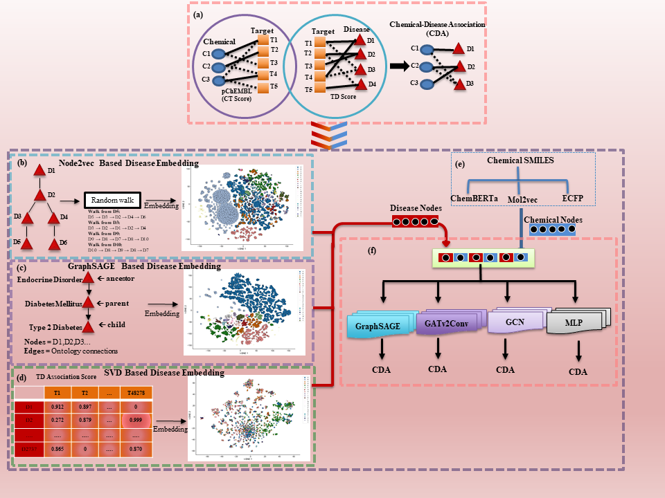

# CDA_Prediction
This repository contains the data and source code for the manuscript Systematic Prediction of Direct Chemical-Disease Association via Multi-Target Network based Disease Embeddings

## ⚙️ Installation

```bash
pip install -r requirements.txt
```

---

## 🚀 Usage Workflow

### 1️⃣ Generate Chemical Embeddings

```bash
python src/embed_smiles.py
```

---

### 2️⃣ Run Prediction

```bash
python src/predict.py
```

---

## 📂 Project Structure

```
chem-disease-link-prediction/
│
├── config.py
├── requirements.txt
├── README.md
│
├── data/              # Input data files
├── models/            # Trained model (.pth)
├── outputs/           # Generated outputs
│
└── src/
    ├── embed_smiles.py
    ├── predict.py
    ├── model.py
    └── data_loader.py
```

---

## 📊 Output

The prediction file will be saved as:

```
outputs/predictions.csv
```

Format:

```
Drugbank_id | DiseaseId | Disease Name | Probability
```

---

## ⚠️ Notes

* Ensure model file is placed in:

  ```
  models/best_model.pth
  ```
* If using GPU, PyTorch will automatically detect CUDA.
* Always run commands from the project root directory.

---

## ✅ Requirements

* Python 3.9+
* PyTorch
* Transformers
* PyTorch Geometric
* Pandas
* NumPy
* PyArrow
