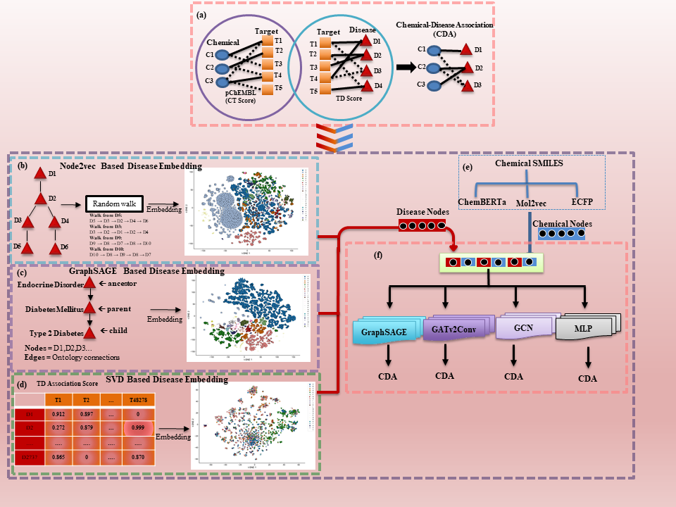

# CDA_Prediction

This repository contains the data and source code for the manuscript
**Systematic Prediction of Direct Chemical-Disease Association via Multi-Target Network based Disease Embeddings**



---

## ⚙️ Installation

```bash
pip install -r requirements.txt
```

---

## 🧪 Example Input File

Your input CSV should look like this:

```csv
ID,smiles
Chemical_1,CCO
Chemical_2,CC(=O)O
Chemical_3,C1=CC=CC=C1
```

### 🔹 Column Description

* **ID** → Unique identifier for each chemical
* **smiles** → SMILES representation of the molecule

---

## 🚀 Usage Workflow

### 1️⃣ Generate Chemical Embeddings

```bash
python src/embed_smiles.py \
  --input data/input_smiles.csv \
  --output outputs/chemberta3_embeddings.tsv \
  --id_col ID \
  --smiles_col smiles \
  --batch_size 32
```

---

### 2️⃣ Run Prediction

```bash
python src/predict.py \
  --chem_emb outputs/chemberta3_embeddings.tsv \
  --disease_emb Disease_embeddings/SVD_Disease_embeddings.parquet \
  --model_path models/best_model.pth \
  --output outputs/predictions.csv \
  --chem_id_col ID \
  --disease_id_col diseaseId \
  --chemical_batch_size 256 \
  --disease_batch_size 512 \
  --compile
```

---

## 📂 Project Structure

```
chem-disease-link-prediction/
│
├── config.py
├── requirements.txt
├── README.md
│
├── data/              # Input data files
├── models/            # Trained model (.pth)
├── outputs/           # Generated outputs
│
└── src/
    ├── embed_smiles.py
    ├── predict.py
    ├── model.py
    └── data_loader.py
```

---

## 📊 Output

The prediction file will be saved as:

```
outputs/predictions.csv
```

### Format

```
Chemical ID | Disease ID | Disease Name | Probability
```

### Example

```csv
Chemical ID,Disease ID,Disease Name,Probability
Chemical_1,D001,Diabetes,0.87
Chemical_1,D002,Cancer,0.12
Chemical_2,D001,Diabetes,0.45
```

---

## ⚠️ Notes

* Ensure model file is placed in:

```
models/best_model.pth
```

* If using GPU, PyTorch will automatically detect CUDA.
* Always run commands from the project root directory.
* Use `--compile` if your model was saved with `torch.compile`.

---

## ✅ Requirements

* Python 3.9+
* PyTorch
* Transformers
* PyTorch Geometric
* Pandas
* NumPy
* PyArrow

---

## 📚 Citation

If you use this work, please cite:

```bibtex
@misc{chem_disease_link_prediction_2026,
  author = {Charvak Muvva and Dohyeon Kim and Keunwan Park},
  title = {Systematic Prediction of Direct Chemical-Disease Association via Multi-Target Network based Disease Embeddings},
  year = {2026},
  note = {Korea Institute of Science and Technology (KIST) and Soongsil University}
}
```
